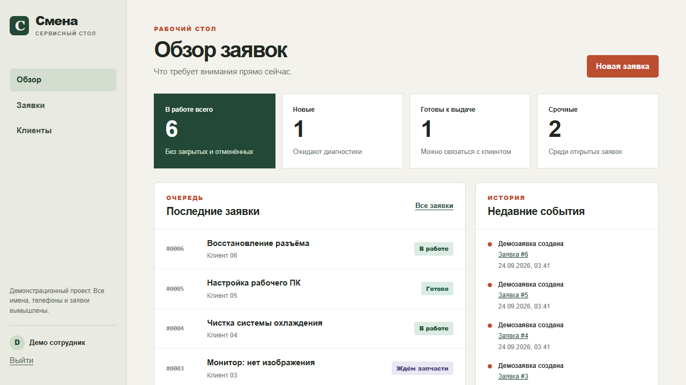
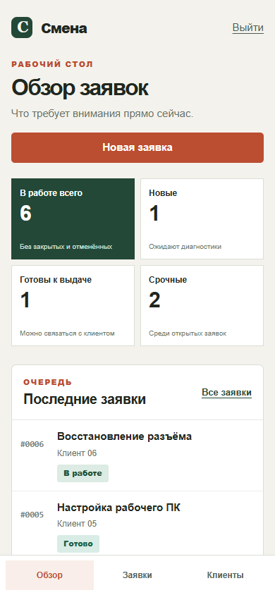

# Смена: сервисный стол на Django

Демонстрационный проект для портфолио. Сотрудник принимает заявку на ремонт, назначает исполнителя, ведёт её по этапам и собирает смету из работ и материалов. Все данные команды `seed_demo` вымышлены. Проект не представляет реальный сервисный центр.





## Что работает

- Вход сотрудника через стандартную систему авторизации Django.
- Обзор открытых, новых, срочных и готовых к выдаче заявок.
- Создание и редактирование клиентов и заявок; поиск и фильтры.
- Контролируемые переходы статусов и история изменений.
- Смета с подсчётом итоговой суммы.
- Django Admin для менеджера.
- Защищённый JSON API только на чтение: `/api/v1/tickets/` и `/api/v1/tickets/<id>/`.
- Тесты для доступа, статусов, сметы, фильтров и API.

## Локальный запуск

Нужен Python 3.12 или новее. Команды из корня проекта:

```powershell
py -3 -m venv .venv
.\.venv\Scripts\python.exe -m pip install -r requirements.txt
.\.venv\Scripts\python.exe manage.py migrate
.\.venv\Scripts\python.exe manage.py seed_demo
.\.venv\Scripts\python.exe manage.py runserver
```

Откройте `http://127.0.0.1:8000/`. Для локального демо: логин `demo`, пароль `demo12345`. Пароль можно задать через переменную `DEMO_PASSWORD` перед запуском `seed_demo`. Команда не работает при `DJANGO_DEBUG=0`.

## Проверка

```powershell
.\.venv\Scripts\python.exe manage.py test
.\.venv\Scripts\python.exe manage.py check
```

Для запуска на Linux/macOS используйте `.venv/bin/python` вместо `.venv\Scripts\python.exe`.

## Структура

`desk/models.py` описывает клиентов, заявки, смету и события. `desk/views.py` содержит рабочие сценарии и API. `desk/tests.py` проверяет правила статусов и права доступа. `templates/` и `static/` содержат адаптивный интерфейс без внешних CDN.

По умолчанию используется SQLite для быстрого старта. Для PostgreSQL задайте `POSTGRES_DB`, `POSTGRES_USER`, `POSTGRES_PASSWORD`, `POSTGRES_HOST` и при необходимости `POSTGRES_PORT`. Перед публичным развёртыванием задайте `DJANGO_DEBUG=0`, `DJANGO_SECRET_KEY`, `DJANGO_ALLOWED_HOSTS` и настройте HTTPS, статику, резервные копии и сервер приложений. Встроенный `runserver` предназначен только для разработки.

Проект намеренно не принимает онлайн-платежи и не отправляет клиентам уведомления: для этого потребовались бы реальные интеграции, которых у демонстрации нет.
